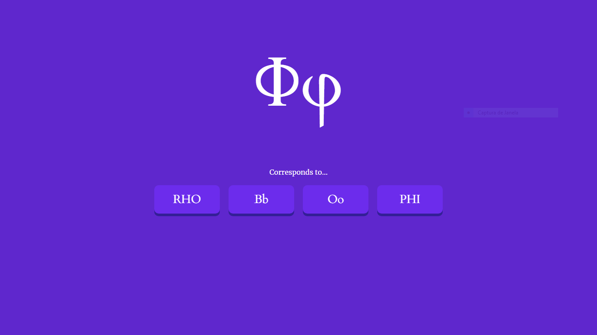

# Greek Project
A little project for greek learners made with svelte and sapper.

## Home Page:

### Transliteration: 
Simple questions with four possible answers for the transliteration of the twenty-for greek letters.

### Words: 
Works as previously, but now for words and their meanings. A quick way to acquire some new vocabulary and have some fun at the same time.

### Sentences:
Soon!

### Cases: 
Soon!

### Texts:
Soon!
